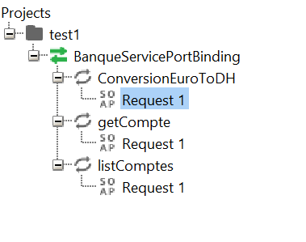
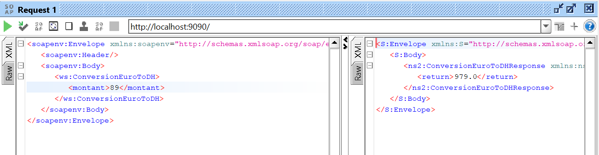
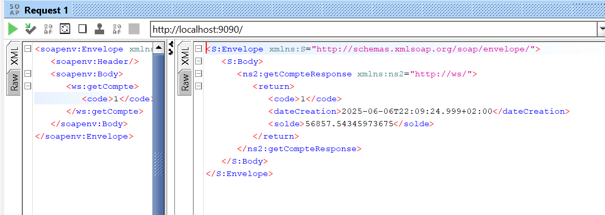
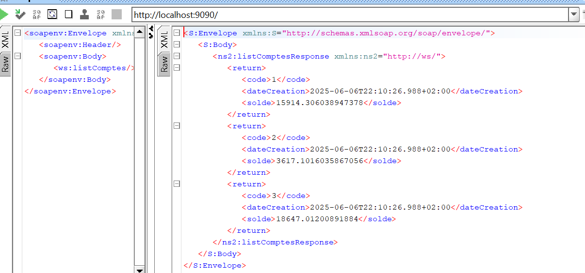
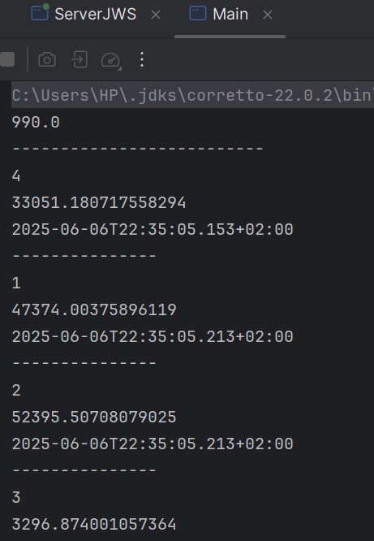

#  Web Service SOAP - BanqueService

## Description

Ce projet Java met en œuvre un **Web Service SOAP** en utilisant **JAX-WS**. Il fournit un service bancaire simple permettant :
- La conversion d’un montant en euros vers dirhams (DH),
- La consultation d’un compte bancaire via son code,
- L’obtention de la liste de tous les comptes.

Le projet est divisé en deux modules :
1. **Serveur SOAP** – Déploie les services avec JAX-WS.
2. **Client SOAP Java** – Consomme le Web service via un proxy généré à partir du WSDL.

---

## Structure du projet

```
ws-soap/
├── src/
│   ├── ws/
│   │   ├── BanqueService.java
│   │   └── Compte.java
│   └── ServerJWS.java
├── client-soap-java/
│   └── src/
│       └── net.mayssam/
│           └── Main.java
│           └── proxy/  <-- généré automatiquement depuis le WSDL
```

---

## Explication du Code

### `BanqueService.java`

Classe principale annotée avec `@WebService`, qui expose trois méthodes via le Web Service :

```java
@WebMethod(operationName = "ConversionEuroToDH")
public double conversion(@WebParam(name = "montant") double mt) {
    return mt * 11;
}
```

- **conversion** : Convertit un montant en euros vers DH. Le taux est fixé à 11.

```java
@WebMethod
public Compte getCompte (@WebParam(name = "code")int code) {
    return new Compte(code, Math.random() * 60000, new Date());
}
```

- **getCompte** : Retourne un objet `Compte` avec un solde aléatoire et la date du jour.

```java
@WebMethod
public List<Compte> listComptes() {
    return List.of(
        new Compte(1, Math.random() * 60000, new Date()),
        new Compte(2, Math.random() * 60000, new Date()),
        new Compte(3, Math.random() * 60000, new Date())
    );
}
```

- **listComptes** : Retourne une liste de 3 comptes simulés avec des données aléatoires.

---

### `Compte.java`

Classe Java simple représentant un compte bancaire avec :
- `code` (identifiant du compte),
- `solde` (montant en DH),
- `dateCreation` (date de création du compte).

Elle contient :
- Un constructeur paramétré,
- Un constructeur vide (utile pour JAXB),
- Des getters et setters pour chaque attribut.

---

### `ServerJWS.java`

Classe contenant le `main` pour **déployer le Web Service** avec JAX-WS :

```java
String url = "http://0.0.0.0:9090/";
Endpoint.publish(url, new BanqueService());
System.out.println("Web service déployé sur " + url);
```

Elle utilise `Endpoint.publish()` pour exposer le service à l'URL fournie.

---

## Tests et Outils

### WSDL
Après avoir lancé le serveur, le WSDL est disponible à :
```
http://localhost:9090/BanqueWS?wsdl
```

### SOAP UI 
Les opérations (`conversionEuroToDH`, `getCompte`, `listComptes`) ont été testées avec **SOAP UI** via l’URL WSDL.

---

## Client SOAP Java

### Étapes réalisées :

1. Création d’un module `client-soap-java`.
2. Génération du stub via **l’outil intégré de l’IDE** (ou via `wsimport`) en fournissant l'URL du WSDL.
3. Un package `proxy` est généré automatiquement, contenant les classes nécessaires à la communication avec le Web Service.

### `Main.java` – Utilisation du Client

```java
BanqueService proxy = new BanqueWS().getBanqueServicePort();
System.out.println(proxy.conversionEuroToDH(90));
```

- Appelle la méthode de conversion sur le service distant.

```java
Compte compte = proxy.getCompte(4);
System.out.println(compte.getCode());
System.out.println(compte.getSolde());
System.out.println(compte.getDateCreation());
```

- Récupère un compte par son code.

```java
proxy.listComptes().forEach(cp -> {
    System.out.println(cp.getCode());
    System.out.println(cp.getSolde());
    System.out.println(cp.getDateCreation());
});
```

- Affiche la liste des comptes retournée par le service.

---
## Captures d'écran

### 1. Après importation du WDSL dans SOAP



### 2. Test de la méthode conversion



### 3. Test de la méthode getCompte 



### 4. Test de la méthode liste des comptes



### 5. Résultat de l’exécution du client SOAP Java (Main.java)



## Auteur

Mayssam Sehait — Étudiante en DataScience & Intelligence Artificielle  
